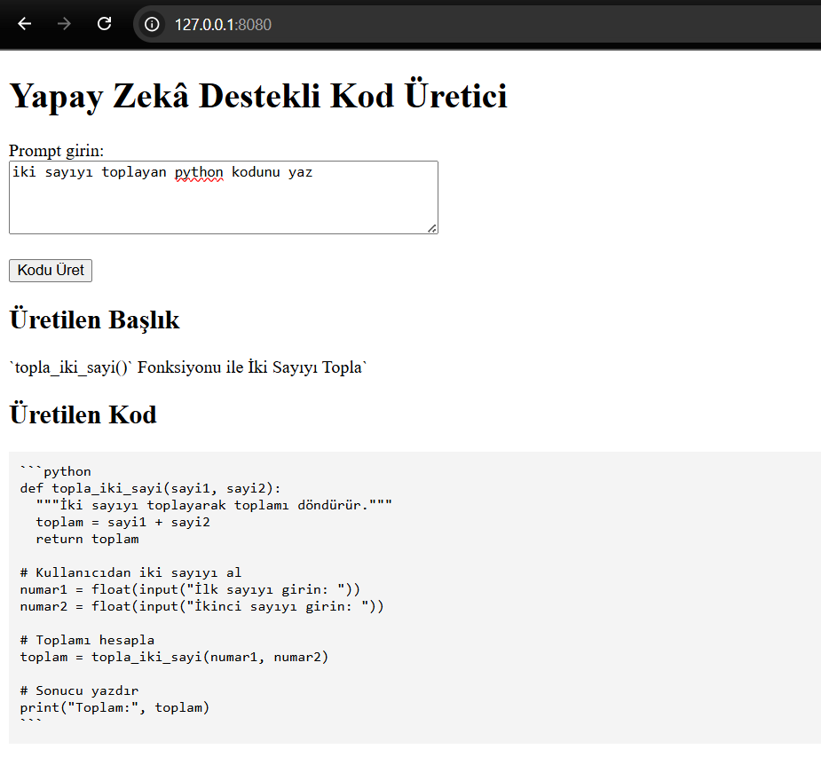

# AI Code Generator - Docker ve Kubernetes Dağıtımı
Bu proje, yapay zeka destekli bir kod üretme uygulamasını içermektedir. Docker ve Kubernetes kullanılarak yerel ortamda çalıştırılabilir ve dağıtılabilir.

## İçindekiler

1. [Başlangıç](#başlangıç)
2. [Teknik Gereksinimler](#teknik-gereksinimler)
3. [Kurulum ve Çalıştırma](#kurulum-ve-çalıştırma)
    - [Docker ile Çalıştırma](#docker-ile-çalıştırma)
    - [Kubernetes ile Çalıştırma](#kubernetes-ile-çalıştırma)

---
## Başlangıç

Bu proje, bir **AI Code Generator** uygulaması içeriyor ve Docker ile paketlenmiştir. Uygulamanın amacı, kullanıcı tarafından sağlanan bazı girdilere dayanarak otomatik olarak kod üretmektir. Kubernetes üzerinde dağıtım yapılabilir.

### Projeyi Çalıştırmak İçin:

- Docker'ı ve Kubernetes'i kurarak yerel ortamda çalıştırabilirsiniz.
- Kubernetes kümesinde dağıtım yapmak için Helm chart kullanabilirsiniz.

## Teknik Gereksinimler

- **Docker**: Uygulamayı bir Docker container'ı olarak çalıştırmak için gereklidir.
- **Kubernetes (Minikube veya başka bir küme)**: Uygulamayı Kubernetes kümesine dağıtmak için gereklidir.
- **Helm**: Kubernetes üzerinde uygulama dağıtımını yönetmek için gereklidir.
- **Git**: Projeyi yerel makinenize klonlamak için gereklidir.
- **Ollama**: LLM modelini çalıştırmak için gereklidir. (https://ollama.com/). Projede kullanılan model `gemma3:1b` olarak ayarlanmıştır.

---

## Kurulum ve Çalıştırma

### Ollama Kurulumu ve Modelin İndirilmesi
Ollama, çalıştırılacak yapay zeka modellerini önceden bilgisayarınıza indirmenizi gerektirir. Projede `gemma3:1b` modeli kullanıldığı için bu modelin yerel makinenizde bulunması gerekir. Model indirildikten sonra Ollama, gelen isteklerde bu modeli kullanarak yanıt üretebilir. Model yüklenmediği takdirde proje çalışırken ilgili model bulunamadığı için hata alırsınız.

Ollama'yı kurmak için aşağıdaki adımları izleyin:
1. [Ollama resmi sitesi](https://ollama.com/) üzerinden işletim sisteminize uygun Ollama'yı indirin ve kurun.
2. Kurulum tamamlandıktan sonra terminal veya komut satırından Ollama'nın düzgün yüklendiğini kontrol edin:

    `ollama --version`

    Bu komut Ollama'nın yüklü sürümünü gösteriyorsa, kurulum başarıyla tamamlanmıştır.

    Kurulumdan sonra, projede kullanılacak olan gemma3:1b modelini indirmeniz gerekir. Aşağıdaki komutu çalıştırarak modeli indirebilirsiniz:

    `ollama pull gemma3:1b`

    Bu işlem tamamlandığında model Ollama içinde kullanılabilir hale gelir ve proje tarafından otomatik olarak kullanılacaktır.

### Docker ile Çalıştırma

Uygulamayı Docker container'ında çalıştırmak için şu adımları takip edebilirsiniz:

1. **Dockerfile ile İmajı Oluşturun**

   Projenin kök dizininde aşağıdaki komutu çalıştırarak Docker imajınızı oluşturun:

   `docker build -t aysenurcandan/ai-code-generator:latest .`
2. **Docker İmajını Çalıştırın**

    Docker container'ı olarak uygulamanızı başlatmak için şu komutu kullanın:

   `docker build -t aysenurcandan/ai-code-generator:latest`

    Bu komut, uygulamanın port 5000'de çalışmasını sağlar. Tarayıcıda http://localhost:5000 adresini ziyaret ederek uygulamanızı görebilirsiniz.

### Kubernetes ile Çalıştırma

Kubernetes üzerinde dağıtım yapmak için şu adımları takip edebilirsiniz:

1. **Minikube Kümesini Başlatın (Eğer Minikube Kullanıyorsanız)**

   Minikube kümesini başlatmak için aşağıdaki komutu çalıştırın:

   `minikube start`

2. **Helm Chart Kullanarak Uygulamayı Dağıtın**

   Helm chart kullanarak Kubernetes kümesine dağıtım yapabilirsiniz. Projenin kök dizininde aşağıdaki komutu çalıştırarak uygulamanızı dağıtın:

   `helm upgrade --install ai-code-generator ./ai-code-generator`

3. **Kubernetes Pod'larının Durumunu Kontrol Edin**

    Uygulamanın pod'larının çalışıp çalışmadığını kontrol etmek için şu komutu kullanabilirsiniz:

   `kubectl get pods`

4. **Port Forwarding ile Uygulamayı Erişilebilir Yapın**

    Kubernetes kümesinde çalışan uygulamaya erişebilmek için port forwarding yapabilirsiniz:

   `kubectl port-forward ai-code-generator-deployment-6b6d79f467-hgzbh 8080:5000`

   Ardından, http://127.0.0.1:8080 adresinden uygulamayı tarayıcınızda görebilirsiniz.
